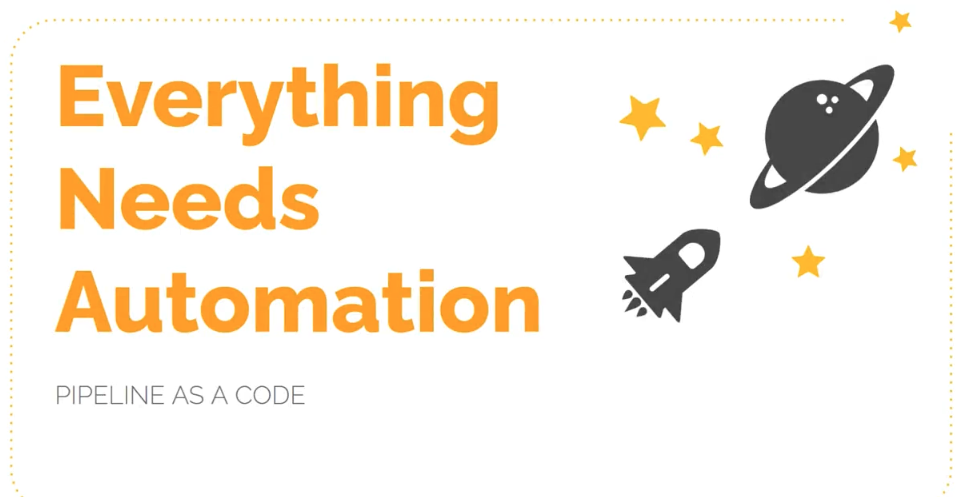

# Everything Needs Automation

In today's fast-paced software development world, automation is not just a luxury—it's a necessity. Manual processes are error-prone, slow, and difficult to scale. By automating repetitive tasks, teams can focus on innovation and deliver value faster.

**Pipeline as Code** is a key enabler of automation in CI/CD workflows. It allows you to:

- **Automate Build, Test, and Deployment:** Define every step of your software delivery process in code, ensuring consistency and reliability.
- **Reduce Human Error:** Automated pipelines minimize the risk of mistakes that can occur with manual interventions.
- **Accelerate Delivery:** Automation speeds up the feedback loop, enabling rapid iteration and faster releases.
- **Scale Effortlessly:** As your project grows, automated pipelines can easily adapt to handle more complex workflows and larger teams.

> **Embrace automation—let your pipelines do the heavy lifting, so you can focus on what matters most: building great software.**

# Pipeline as a Code

## Overview

This project demonstrates the concept of "Pipeline as a Code"—a practice where data or software pipelines are defined, managed, and versioned using code. This approach enables automation, reproducibility, and collaboration for building and maintaining complex workflows.

## Features
- Define pipelines programmatically
- Version control for pipeline definitions
- Automation and reproducibility

## Introduction

- Automate pipeline setup with Jenkinsfile
- Jenkinsfile defines Stages in CI/CD Pipeline
- Jenkinsfile is a text file with Pipeline DSL Syntax
- Syntax is similar to Groovy
- Two Syntax options:
  - Scripted
  - Declarative

## Getting Started

1. **Clone the repository:**
   ```bash
   git clone <repo-url>
   ```
2. **Navigate to the project directory:**
   ```bash
   cd PAAC-Jenkinsfile
   ```
3. **Install dependencies:**
   (Add instructions here for your stack, e.g., Python, Node.js, etc.)

## Usage

(Provide examples or instructions on how to use or run the pipeline code.)

## Contributing

Contributions are welcome! Please open issues or submit pull requests for improvements.

## License

(Add your license information here)

## Pipeline Concepts

- **Pipeline**
- **Node/Agent**
- **Stage**
- **Step**

## Sample Jenkinsfile

```groovy
pipeline {
    agent any
    stages {
        stage('Build') {
            steps {
                // Build steps go here
            }
        }
        stage('Test') {
            steps {
                // Test steps go here
            }
        }
        stage('Deploy') {
            steps {
                // Deploy steps go here
            }
        }
    }
}
```

## Jenkins Pipeline Structure Examples

### Basic Pipeline Structure
```groovy
pipeline {
    agent {
        // agent configuration
    }
    tools {
        // tool configuration
    }
    environment {
        // environment variables
    }
    stages {
        // stages go here
    }
}
```

### Agent and Tools Example
```groovy
pipeline {
    agent {
        label "master"
    }
    tools {
        maven "Maven"
    }
}
```

### Environment Example
```groovy
pipeline {
    environment {
        NEXUS_VERSION = "nexus3"
        NEXUS_PROTOCOL = "http"
        NEXUS_URL = "you-ip-addr-here:8081"
        NEXUS_REPOSITORY = "maven-nexus-repo"
        NEXUS_CREDENTIAL_ID = "nexus-user-credentials"
        ARTVERSION = "${env.BUILD_ID}"
    }
}
```

### Stages Example
```groovy
pipeline {
    stages {
        stage("Clone code from VCS") {
            // steps go here
        }
        stage("Maven Build") {
            // steps go here
        }
        stage("Publish to Nexus Repository Manager") {
            // steps go here
        }
    }
}
```

### Stage with Steps and Post
```groovy
pipeline {
    stages {
        stage("Clone code from VCS") {
            steps {
                // steps go here
            }
            post {
                // post actions go here
            }
        }
    }
}

### Stage with Steps and Post-Success Example
```groovy
pipeline {
    stage('BuildAndTest') {
        steps {
            sh 'mvn install'
        }
        post {
            success {
                echo 'Now Archiving...'
                archiveArtifacts artifacts: '**/target/*.war'
            }
        }
    }
} 